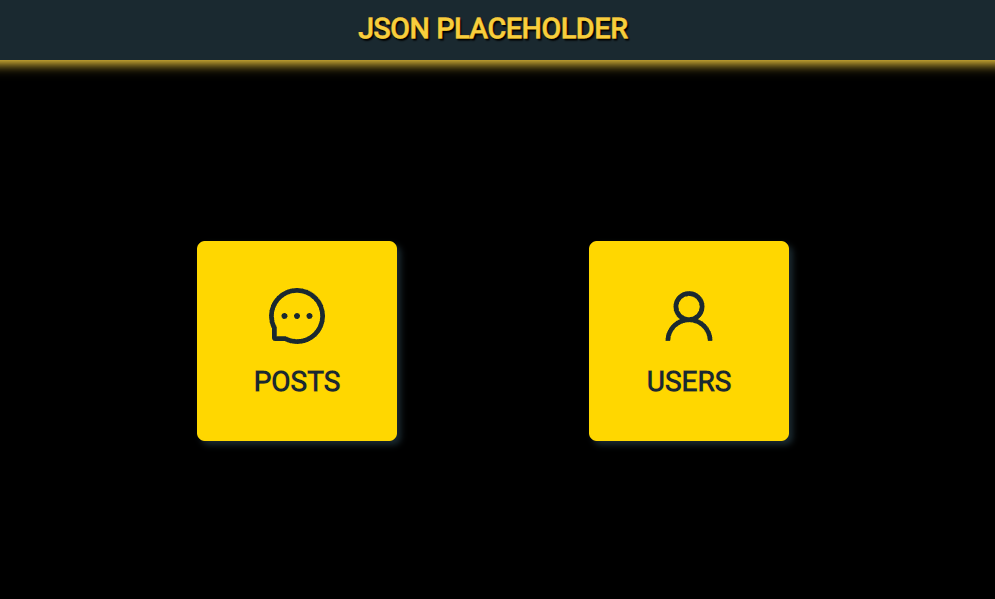

# DESAFIO JSON PLACEHOLDER

### Deploy: https://alkabot-desafio-placeholder.vercel.app/

 

     
 

## Objetivo:

## Foi projetar uma interface para atender as seguintes necessidades.

- `Listagem de posts - https://jsonplaceholder.typicode.com/posts`
- `Listagem de comentários de um post - https://jsonplaceholder.typicode.com/posts/[ID]/comments`
- `Listagem de usuários - https://jsonplaceholder.typicode.com/users`
- `Detalhes de um usuário - https://jsonplaceholder.typicode.com/users/[ID] `

## Descrição:

- `Projeto feito com React JS + Typescript`
- `Utilizado Axios para realizar as requisições`
- `React router dom para gerenciamento de rotas`

## Sobre o site:

- `Ao entrar no site, o usuário irá se deparar com icones de posts e usuários`
- `Clicando no post ele será redirecionado para uma lista de 100 posts com a opção de click, nele será possivel ver os comentários daquele post`
- `O icone de usuário irá lista todos usuário e também permitirá ir para uma tela de informações do mesmo.`
- `Um header para voltar a página inicial`
- `Totalmente responsivo`

## <i>Douglas Monteiro</i> 😁🔥🚀
